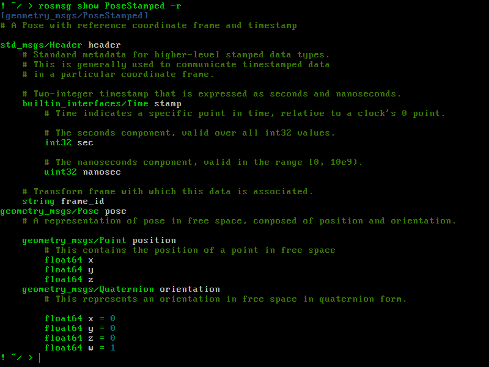

## Unifying the ROS command line tools

One impairment to ROS 2 adoption is that all of the commands that have worked their way into muscle memory for ROS 1 developers no longer work. Also, all of the commands in ROS 2 tend to be at least two characters longer. To get information about a topic in ROS 1, one could type `rosto<tab>` (5 characters before tab), but in ROS 2 the equivalent is `ros2 to<tab>` (7 characters before tab).

On top of the differences between the ROS 1 and ROS 2 command line tools, there is also a wide gulf between the different build tools that are available. For example, if you want to build a specific package (e.g. `pr2_moveit_config`) and all its dependencies, there are three possible commands, depending on the build tool.

| build tool     | command                                                |
|----------------|--------------------------------------------------------|
| `catkin_make`  | `catkin_make --only-pkg-with-deps pr2_moveit_config`   |
| `catkin_tools` | `catkin build pr2_moveit_config`                       |
| `colcon`       | `colcon build --packages-up-to pr2_moveit_config`      |

The `ros_command` package provides a set of command line interfaces for common actions with syntax similar to ROS 1 and `catkin_tools`, since those are often simpler, shorter and more familiar to a majority of ROS developers [[citation needed]](https://xkcd.com/285/).

# Setup
This tool uses Python 3.

    git clone git@github.com:MetroRobots/ros_command.git
    cd ros_command
    sudo pip3 install -r requirements.txt

It also uses some BASH scripts. It is recommended that you add `source /path/to/ros_command/setup.bash` to your `.bashrc`. This will add the executable scripts to your `PATH` and add the library to your `PYTHONPATH`.

    echo "source $PWD/setup.bash" >> ~/.bashrc

Note that if you are using ROS 1, it is recommended that you source the setup AFTER you source ROS. Many of the commands in this library have the exact same syntax as their native ROS 1 counterparts, so sourcing after ROS gives these scripts priority.

# Commands

## roscd
This command was not implemented in ROS 2. There is the somewhat similar [`colcon_cd`](https://colcon.readthedocs.io/en/released/user/installation.html#quick-directory-changes) command, but it requires additional installation. Instead, this package has implemented a version of `roscd` that works with ROS 2. Because you cannot change the shell's working directory from within a Python script, `roscd` is implemented in `bash`, depending on the Python script `get_ros_directory`.

## rosbuild
`rosbuild` functions as a convenient wrapper for `catkin_make`, `catkin_tools` and `colcon`. (Apologies to all the people still using `rosbuild` in its [original form](http://wiki.ros.org/rosbuild), but its been deprecated since 2013.) Running `rosbuild` will automatically determine your current workspace root folder and which build tool it uses, and then running the equivalent native build command. For example running `rosbuild pr2_moveit_config` will run the three commands shown in the table in the introduction.

 * Like `catkin build`, it can be run from anywhere within the workspace directory structure.
 * Can play notification sounds when complete (see Configuration section below)
 * Displays the build status in a fancy [blessed](https://github.com/jquast/blessed)-based terminal-focused graphical user interface (although not for `catkin_make`).

https://user-images.githubusercontent.com/1016143/148160202-03f6a5e5-f914-459b-8157-b50d2ed3d3c1.mp4

 * Other arguments not specified in the table below are passed into the raw build command.

| Category              | rosbuild                    | colcon                            | catkin_tools                      | catkin_make                            |
|-----------------------|-----------------------------|-----------------------------------|-----------------------------------|----------------------------------------|
| **General**           | -c, --continue_on_failure   | --continue-on-error               | --continue-on-failure             | ❌                                     |
|                       | -j N --jobs N               | --parallel-workers N              | --jobs N                          | --jobs N                               |
|                       | -b, --cmake_build_type X    | --cmake_args -DCMAKE_BUILD_TYPE=X | --cmake_args -DCMAKE_BUILD_TYPE=X | -DCMAKE_BUILD_TYPE=X                   |
| **Package Selection** | --this                      | --packages-up-to pkg_name         | --this                            | --pkg pkg_name                         |
|                       | --this --no-deps            | --packages-select pkg_name        | --this --no-deps                  | --only-pkg-with-deps                   |
|                       | -s --skip_packages pkg_name | --packages-skip pkg_name          | 🔲                                | -DCATKIN_BLACKLIST_PACKAGES="pkg_name" |
|                       | pkg_name                    | --packages-up-to pkg_name         | pkg_name                          | --pkg pkg_name                         |

 * ❌ There is no equivalent to `--continue-on-failure` with `catkin_make` (and it is probably not possible)
 * 🔲 There is no equivalent to `--skip_packages` in `catkin_tools`, although you could theoretically do it by parsing the dependency tree
 * If `cmake_build_type` is NOT specified, then it defaults to the value in the Configuration. The command line argument does overwrite the configured one.

## rosdep_install
One useful arcane command that pops up in many places/aliases (in both ROS 1 and ROS 2) is

    rosdep install --ignore-src -y -r --from-paths .

According to the manual , `rosdep install` will "download and install the dependencies of a given package or packages".
 * `--from-paths .` specifies that dependencies should be installed for all packages in the current directory
 * `--ignore-src` will ignore packages that you have the source code checked out
 * `-y` makes it non-interactive (so it defaults to installing everything without prompting)
 * `-r` continues when you get errors

Essentially, this is a command for installing all of the upstream dependencies for the packages in your workspace.

Now there's the new simple command `rosdep_install` which will do the same thing. A version with a terminal GUI similar to `rosbuild` is in development.

## rosmsg / rossrv / rosaction
In ROS 2, `rosmsg` and `rossrv` were replaced by `ros2 interface`, which can also handle actions. For most commands, calling the `ros_command` version of `rosmsg` and `rossrv` will just call either the ROS 1 `rosmsg/rossrv` command or the equivalent `ros2 interface` command.

#### Brand New Functionality
 * The basic `show` command now has syntax highlighting.
   
 * The `show` command now has a `-r` option to recurse through the interface definitions.
   

#### Added ROS 1 Functionality
 * `rosaction <command>` - `rosaction` does not exist in ROS 1, so it is implemented here, often calling `rosmsg <command>` on the constituent parts (i.e. Goal/Result/Feedback).

#### Added ROS 2 Functionality
 * `ros<msg|srv|action> show` without namespaces - The equivalent command to ROS 1's `rosmsg show Point` is `ros2 interface show geometry_msgs/msg/Point`. This is cumbersome for a number of reasons. First, ROS 1 is nearly half has short (17 chars vs 43 chars). It also requires you remember what package the message you are looking for is. The version implemented here will search for matching fully qualified names, and then print the fully qualified name and the contents of the interface definition.
 * `rosmsg proto` also works without namespaces IF there's only one type that matches.

## source_ros
If you use a single ROS workspace, then you probably source the appropriate `setup.bash` from the `.bashrc` file. However, if you use multiple, you can source the appropriate `setup.bash` with one simple command: `source_ros`. This will find the appropriate `setup.bash` by determining the current ROS Workspace based on the folder the script is executed in. Typically, this will either source the `devel/setup.bash` or `install/setup.bash` depending on whether it is ROS 1 or 2. (You can also have a setup.bash in the workspace root if you need custom logic to source additional environment variables.)

(Under the hood, this runs the `get_current_setup_bash` script to print the appropriate filename)

## rosrun and rosdebug
In ROS 1, `rosrun` works the same way as the standard ROS 1 version. In ROS 2, it runs `ros2 run`.

`rosdebug` does the same things, except it will insert `--prefix 'gdb -ex run --args'` into the appropriate place to run your node using `gdb`.

## roslaunch
Similar to `rosrun`, `roslaunch` here either just runs ROS 1's `roslaunch` or ROS 2's `ros2 launch`.

## rosclean
The `rosclean` command works as a hybrid of `rosclean` and `catkin clean`.
 * With no arguments (`rosclean`) the script will ask whether you want to delete the workspace's `devel/install/build/log` directories as well as the global `~/.ros/log` directory while also printing their sizes.
 * With the `-y` flag (`rosclean -y`) it will not prompt you and just delete things!
 * To just print the sizes without deleting anything, you can run `rosclean check` or `rosclean -c`.
 * You can also avoid the computation of folder sizes with the `-n` flag.
 * You can also provide a list of packages (`rosclean std_msgs nav2_core`) and it will attempt to delete just those portions of the workspace.

You can also throw the word `purge` at the beginning just to mirror the ROS 1 `rosclean` more closely.

# Configuration
Users may change the default behavior of `ros_command` by putting settings in yaml files in two places.
 * `ros_command.yaml` in the workspace root (highest precedence)
 * `~/.ros/ros_command.yaml`

The current settings you may change are summarized in this table.

| key              | type                   | default | note                                                           |
|------------------|------------------------|---------|----------------------------------------------------------------|
| cmake_build_type | string                 | Release | [CMAKE_BUILD_TYPE](https://cmake.org/cmake/help/latest/variable/CMAKE_BUILD_TYPE.html) |
| graphic_build    | boolean                | True    | By default, `rosbuild` shows a fancy graphical interface       |
| success_sound    | string / absolute path | None    | Sound file path to play after successful builds                |
| fail_sound       | string / absolute path | None    | Sound file path to play after **un**successful builds          |

# Power Usage
If you like really short, convenient commands, try adding these to your `~/.bashrc`

    alias sros='source_ros'                  # Easier tab completion than source_ros
    alias asdf='rosbuild --this -c'          # Builds the package in the current directory (and its dependencies)
    alias zxcv='rosbuild --this --no-deps'   # Builds just the package in the current directory

# Acknowledgements
 * `ros_command`'s core functionality was implemented at [PickNik Robotics](https://github.com/PickNikRobotics).
 * The implementation of `roscd` was originally developed by [Vatan Aksoy Tezer](https://github.com/vatanaksoytezer)
